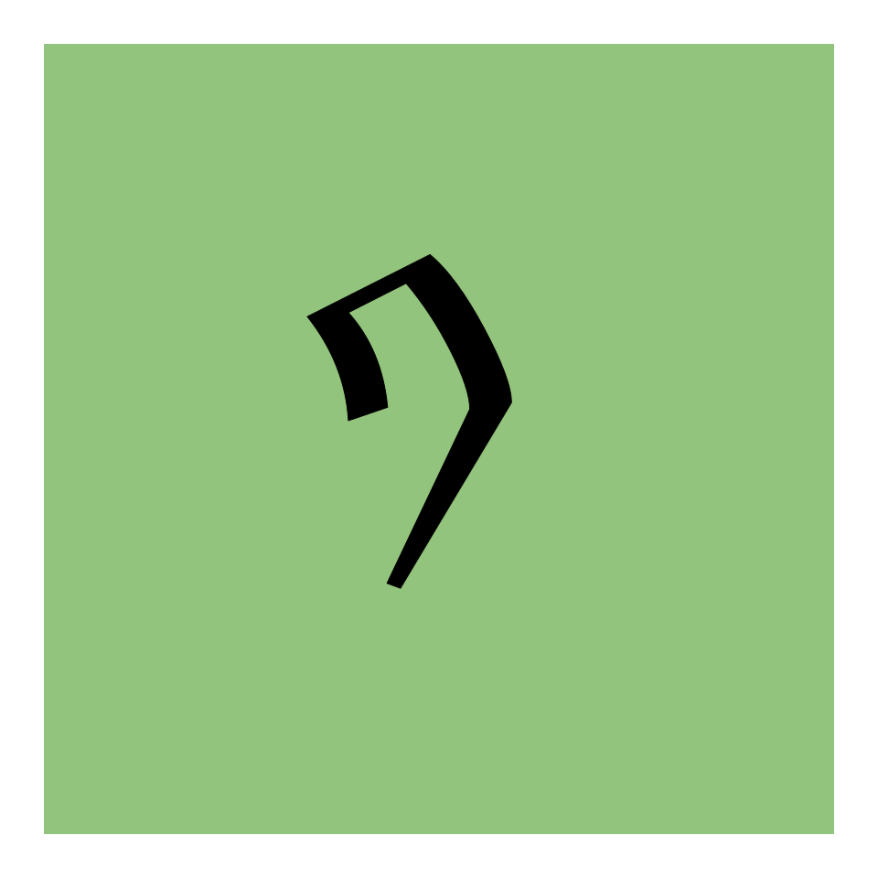
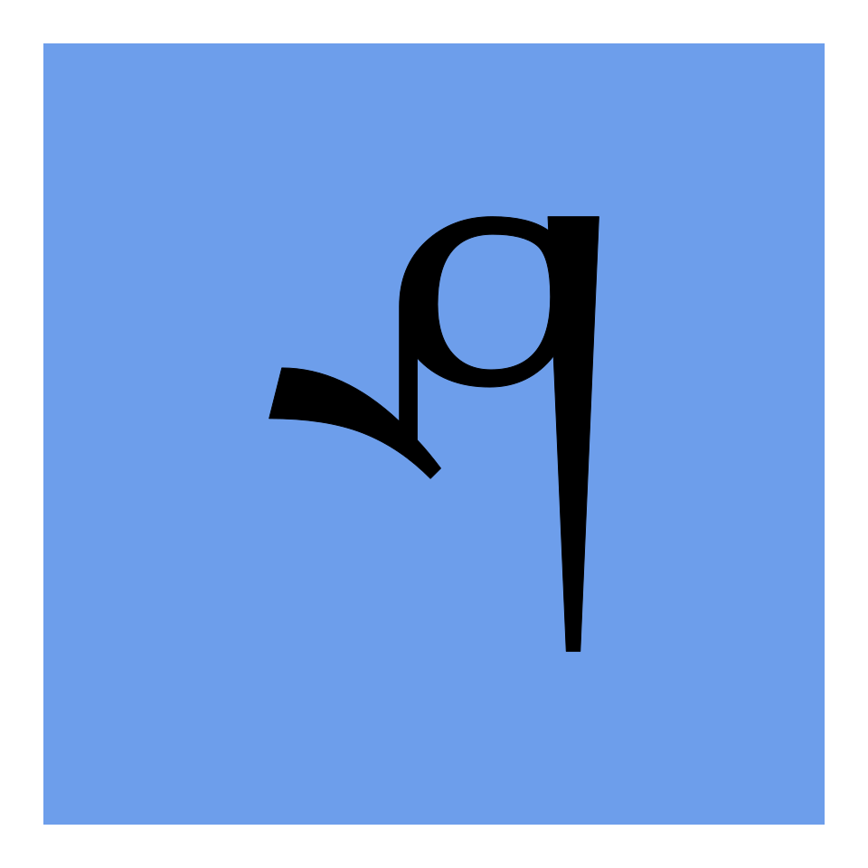
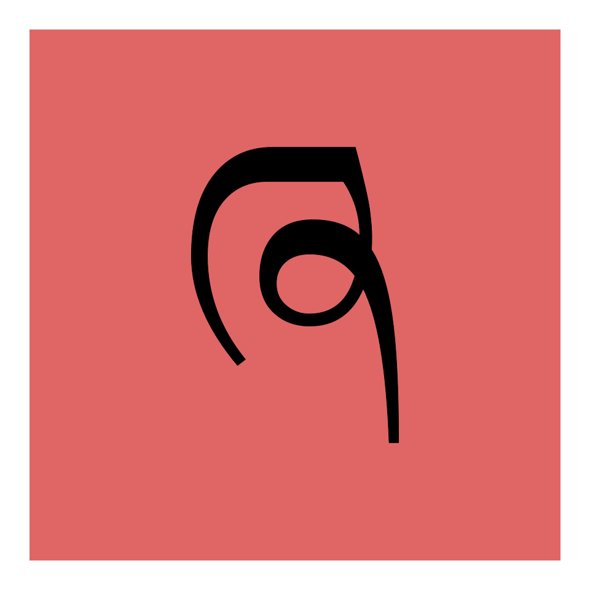

# A jsPsych implementation of the two-step task of [Daw et al. (2011)](https://doi.org/10.1016/j.neuron.2011.02.027)

This task (also known as the two-stage task) is meant to measure the contribution of model-based and model-free reinforcement learning strategies to human decision making. The code here allows you to easily integrate this task into your online study. To see how the trials look, click [here](https://kinleyid.github.io/rsrch/jspsych-2st/short-example.html). A full example with detailed instructions for participants can be found [here](https://kinleyid.github.io/rsrch/jspsych-2st/full-example.html).

## Contents of this documentation:
1. [Quick setup](#quick-setup)
2. [Creating trials](#creating-trials)
3. [Data produced](#data-produced)
4. [Parameters](#parameters)
5. [Creating custom instructions](#creating-custom-instructions)
---

## Quick setup

First, source the script "2st.js" along with the required jsPsych plugins:

```html
<script src="https://cdn.jsdelivr.net/gh/kinleyid/jspsych-2st@v1.0.0/2st.js"></script>
<script src="https://unpkg.com/@jspsych/plugin-call-function"></script>
<script src="https://unpkg.com/@jspsych/plugin-canvas-keyboard-response"></script>
<script src="https://unpkg.com/@jspsych/plugin-instructions"></script>
```

(Note that this code is currently compatible with jsPsych 7+. If you need support for legacy versions of jsPsych, please contact me at kinleyid@mcmaster.ca)

Then, a minimal script to run the two-step task with the default parameters as described in [Daw et al. (2011)](https://doi.org/10.1016/j.neuron.2011.02.027) is as follows:

```javascript
var jsPsych = initJsPsych();
var timeline = [
  { // Preload images
    type: jsPsychPreload,
    images: two_step_task.images.list_filenames()
  },
  // Initialize experiment
  two_step_task.trials.initialize_experiment(),
  // Run interactive instructions
  two_step_task.trials.interactive_instructions(),
  // Reset reward probabilities
  two_step_task.trials.initialize_experiment(),
  { // Full experiment, 100 trials
    timeline: [two_step_task.trials.single_trial()],
    repetitions: 100
  },
];
jsPsych.run(timeline);
```

By default, `list_filenames` returns the paths to the images [here](img/), which can be seen in [this table](#images) below. These can be substituted by setting various attributes of the `two_step_task.images.filenames` object:

```javascript
two_step_task.images.filenames['1A'] = 'path/to/my-1A.png'
two_step_task.images.filenames['reward'] = 'path/to/my-reward.png'
```

This should be done before the output of `list_filenames` is passed to the `jsPsychPreload` trial.

## Creating trials

`two_step_task.trials` contains a set of functions to create jsPsych trial objects that can be pushed to the timeline. An "initialization" trial that is created using `two_step_task.trials.initialize_experiment()` must be pushed to the timeline before any two-step task trials. This trial ensures the necessary images are loaded, (re-)randomizes reward probabilities, and (re)sets an internal trial count to 0. A single two-step task trial can then be created using `two_step_task.trials.single_trial()` and consists of the following "sub-trials":

```javascript
[ // Timeline of a single two-step task trial:
  two_step_task.trials.initialize_trial(), // Set and reset important info passed between trials
  two_step_task.trials.step_1(), // Solicit response to step 1
  two_step_task.trials.transition(), // Compute transition to step 2 state
  two_step_task.trials.animation(), // Animate step 1 selection
  two_step_task.trials.step_2(), // Solicit response to step 2
  two_step_task.trials.animation(), // Animate step 2 selection
  two_step_task.trials.reward(), // Show reward or lack
  two_step_task.trials.show_timeout(), // Show time-out screen, if applicable
  two_step_task.trials.update_reward_probs(), // Drift reward probabilities
  two_step_task.trials.record_data() // Record data from the entire trial
]
```

These sub-trials can be recombined to modify the task. NB: in the trial timeline produced by `two_step_task.trials.single_trial()`, the trials from `step_1()` to `reward()` are contained within a sub-timeline that can be aborted in case the participant doesn't make a response quickly enough.

`two_step_task.trials.interactive_instructions()` can be used to create a set of interactive instruction in which participants first become familiar with the second stage, then the first.

## Data produced

After a trial (including both steps of the task) is complete, the information about that trial is stored in a `jsPsych.data` property called `two_step_task_info`. An example of how this property looks can be seen [here](example-data/data.csv) along with an example data extraction R script [here](example-data/extract-data.R). `two_step_task_info` is an object with the following attributes:

| Attribute | Description |
| --- | --- |
| `trial_n` | Trial number |
| `reward_probs` | Object mapping each terminal state to its associated reward probability. E.g. `{2AA: 0.33, 2AB: 0.27, 2BA: 0.60, 2BB: 0.35}` |
| `step_1_action` | Action taken during step 1 ( `'1A'` or  `'1B'`). |
| `step_1_rt` | Reaction time, in ms, during step 1. |
| `step_2` | The state reached to enter step 2 (`'2A'` or `'2B'`). |
| `transition` | Specifies whether the step one-to-step two transition was `'common'` or `'rare'`. |
| `step_2_action` | Action taken during step 2 (`'2AA'`, `'2AB'`, `'2BA'`, or `'2BB'`). |
| `step_2_rt` | Reaction time, in ms, during step 2. |
| `reward` | Specifies whether a reward was received (Boolean)
| `timeout` | Specifies whether the participant took to long to make a response, thus ending the trial early (Boolean) |

## Parameters

### Timing

Various aspects of the timing of trials are controlled by the following set of parameters:

| Parameter | Description | Default value (in milliseconds) |
|------|------|------|
| `two_step_task.interaction.timeout_ms` | Length of time allowed for a response, after which a trial "times out" | 2000 |
| `two_step_task.interaction.timeout_display_ms` | Duration of feedback indicating a trial has "timed out" | 1000 |
| `two_step_task.animation.length_ms` | Length of animation in which icons representing actions move from one side of the screen to the top middle | 500 |
| `two_step_task.reward.display_ms` | Duration of feedback indicating reward or lack thereof | 1000 |

### Keyboard input

The parameter `two_step_task.interaction.choice_keys` specifies which keys are available to participants to make their responses. It has a default value of `['z', 'm']`.

### Images

Image filenames are attached to a set of attributes of `two_step_task.images.filenames`. The paths to the default images, as shown below, are set using `two_step_task.images.set_files_to_default`.

| Image | Description | Default |
|------|------|------|
| `two_step_task.images.filenames.1A` | Image associated with action 1A |  |
| `two_step_task.images.filenames.1B` | Image associated with action 1B |  |
| `two_step_task.images.filenames.2AA` | Image associated with action 2AA |  |
| `two_step_task.images.filenames.2AB` | Image associated with action 2AB |  |
| `two_step_task.images.filenames.2BA` | Image associated with action 2BA |  |
| `two_step_task.images.filenames.2BB` | Image associated with action 2BB |  |
| `two_step_task.images.filenames.reward` | Image shown when a reward is received |  |
| `two_step_task.images.filenames.no_reward` | Image shown when a reward is not received |  |
| `two_step_task.images.filenames.timeout` | Image shown when a participant takes too long to make a response |  |

## Creating custom instructions

As described above, the function `two_step_task.trials.interactive_instructions()` creates a set of interactive instructions for participants. However, performance on the two-step task is sensitive to instructions, as shown by [Feher da Silva & Hare, 2020](https://doi.org/10.1038/s41562-020-0905-y). If you want to change only the text of the example instructions, you're probably best off simply creating a copy of the [source code](2st.js) of this function in your own code and editing the text there. If you want to customize the interactivity, see below, where I have annotated the source code of the `interactive_instructions()` function as a guide to creating custom interactive instructions.

### `interactive_instructions()` explained

After an initial introduction to the experiment, the participants will practice only step 2 (opening boxes to immediately either receive rewards or not). The reward probabilities for each action in step 2 are set to known values to introduce participants to the idea that actions will have different values. Moreover, time limits will be eliminated by temporarily setting `two_step_task.interaction.timeout_ms` to `undefined`. The previous value of `timeout_ms` is stored in a persistent variable so that it can be reset later.

```javascript
var instr_1 = {
  type: jsPsychInstructions,
  ...
}

var timeout_ms_tmp;
var initialize_step_2_practice = {
  type: jsPsychCallFunction,
  func: function() {
    two_step_task.reward.probs = { // Deterministic for practice--they will be randomized later
      '2AA': 0.25,
      '2AB': 0.5,
      '2BA': 0.5,
      '2BB': 0.75
    };
    // Time limits will be temporarily disabled by setting the timing parameter to undefined; It will be reset later, so store it in a temporary variable in the meantime
    timeout_ms_tmp = two_step_task.interaction.timeout_ms;
    two_step_task.interaction.timeout_ms = undefined;
  }
}
```

Next, a jsPsych trial is created to allow the participant to practice only step 2. The timeline consists of, first, `initialize_trial()`, followed by a `jsPsychCallFunction` trial whose only role is to determine which state in step 2 should be shown. Ordinarily, this would be determined in a `two_step_task.trials.transition()` trial, which would refer back to the action taken in step 1 and the transition structure `two_step_task.transition.structure`. However, to skip step 1, we are simply choosing a step 2 state at random. The participant then completes step 2, their choice is animated, and the reward, if any, is displayed. This repeats 10 times.

```javascript
var step_2_practice = {
  timeline: [
    two_step_task.trials.initialize_trial(),
    { // Randomize which second step state is shown
      type: jsPsychCallFunction,
      func: function() {two_step_task.data.step_2 = Math.random() < 0.5 ? '2A' : '2B'}
    },
    two_step_task.trials.step_2(),
    two_step_task.trials.animation(),
    two_step_task.trials.reward()
  ],
  repetitions: 10
}
```

After this, a further set of text instructions explains to participants which actions were more and less favourable, and introduces the idea of transitioning from step 1 to step 2. To initialize a "full task practice" containing steps 1 and 2 with time limits on responses, an initialization trial is used to reset the value of `two_step_task.interaction.timeout_ms` to its previous value. Then, 10 full trials can be created using the `two_step_task.trials.single_trial()` function.

```javascript
var instr_2 = {
  type: jsPsychInstructions,
  ...
}

var initialize_full_task_practice = {
  type: jsPsychCallFunction,
  func: function() {
    two_step_task.interaction.timeout_ms = timeout_ms_tmp;
  }
}

var full_task_practice = {
  timeline: [two_step_task.trials.single_trial()],
  repetitions: 10
}
```

A final bit of preamble is then shown before the complete instructions timeline is assembled.

```javascript
var final_instr = {
  type: jsPsychInstructions,
  ...
}

var instructions = {
  timeline: [
    instr_1,
    initialize_step_2_practice,
    step_2_practice,
    instr_2,
    initialize_full_task_practice,
    full_task_practice,
    final_instr
  ]
}
```
